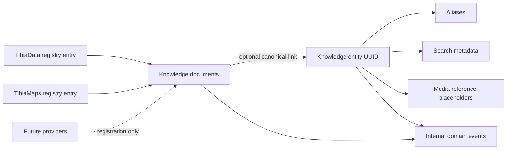

# Knowledge Platform — Stage 2A-1

Stage 2A-1 adds a provider-neutral persistence and identity layer. It does not
call providers, synchronize data, expose a new API, implement search UI, or use
AI, embeddings, pgvector, or media processing.

## Module boundaries

All Knowledge Platform behavior lives under `backend/app/knowledge`:

- `providers` defines provider capabilities without network code.
- `registry` persists providers and data-driven entity types.
- `models` owns provider-neutral SQLAlchemy records.
- `services` creates, resolves, aliases, updates, and records merges.
- `storage` retains every raw provider response as a separate document.
- `metadata` and `indexing` derive non-embedding search metadata.
- `schemas` validates internal service commands.
- `adapters` and `workers` are explicit Stage 2A-2 placeholders.

The only hook outside the module imports its models into shared SQLAlchemy
metadata for Alembic and tests. Existing authentication, guild, raffle,
notification, permission, scheduler, frontend, and PostgreSQL runtime behavior
is unchanged.

## Canonical identity

Each entity has a permanent UUID, an extensible string entity type, a canonical
name and slug, and a provider-independent language-neutral identifier. Provider
document IDs exist only on knowledge documents. Aliases are normalized and
unique within an entity type, preventing a provider spelling from creating a
second canonical entity while allowing the same term in different domains.

## Raw JSONB and indexing

Provider payloads and their metadata remain complete JSONB documents. Each
retrieval creates a new row with checksum, provider version, ETag, language, and
retrieval time; previous versions are never overwritten. Provider capabilities,
rate limits, search tokens, aliases, entity-type metadata, and internal event
payloads also use JSONB.

PostgreSQL GIN indexes cover raw documents, document metadata, aliases, and
search tokens. A `pg_trgm` GIN index covers normalized names. Relational indexes
cover provider/document history, entity/status lookup, visibility/weight,
checksums, popularity, and pending domain events.

## Deferred to Stage 2A-2

- Provider adapters and HTTP clients
- Import workers, schedules, retries, and orchestration
- Mapping provider documents onto existing Cyclopedia records
- Merge policies and enrichment precedence
- Search APIs and query ranking
- Provider health polling and operational UI
- Media ingestion
- AI, embeddings, and pgvector
